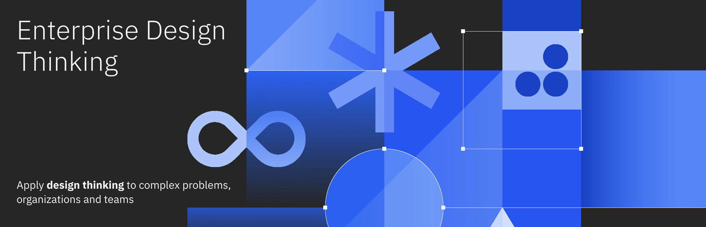

## IBM Enterprise Design Thinking Skill

Bring IBM's proven design thinking framework to your development, ideas planning workflow with this Claude Code skill.


## When to Use This Skill

Use this skill whenever you want to:

- **Brainstorm project ideas** — Define new products, tools, or internal tools
- **Understand user needs before coding** — Ground your work in real user behavior
- **Write user stories or Hills** — Create outcome-focused requirements
- **Run a Playback** — Share progress and collect feedback effectively
- **Structure a problem statement** — Reframe challenges as opportunities
- **Think through "who is this for?"** — Define your target user clearly
- **Plan an MVP** — Design the smallest test for your riskiest assumption
- **Apply human-centered thinking** — Bring user empathy to engineering tasks

---

## What is IBM Enterprise Design Thinking?

IBM Enterprise Design Thinking is a framework that gives teams a **shared language to align faster, focus on what matters, and deliver with empathy and speed**. It applies design thinking to complex problems, organizations, and teams by unifying everyone around a customer-centered approach rather than individual objectives.

According to IBM, organizations using Enterprise Design Thinking have achieved:
- **2x Faster** time to market
- **300%** return on investment
- **75%** increased team efficiency

---

## The Framework

Enterprise Design Thinking consists of three interconnected parts:

### The Three Principles

| Principle | Description |
|-----------|-------------|
| **A Focus on User Outcomes** | Drives business success by prioritizing what users need to accomplish rather than shipping features. Teams are measured by "how well we fulfill our users' needs" rather than the functions they deliver. |
| **Restless Reinvention** | Means treating "everything as a prototype." While fundamental human needs remain constant, the solutions addressing them evolve through technological advancement and changing expectations. |
| **Diverse Empowered Teams** | Move faster by combining varied perspectives with agency to make decisions. Diversity generates more ideas, while empowerment enables teams to turn those ideas into outcomes. |

### The Loop

A continuous cycle of **Observe**, **Reflect**, and **Make** that drives teams to understand the present and envision the future.

- **Observe**: Immerse yourself in users' world to understand context, uncover needs, and gather honest feedback.
- **Reflect**: Synchronize movements, synthesize learnings, and share insights.
- **Make**: Give form to abstract ideas through prototyping and experimentation. Everything is a prototype.

### The Keys

#### Hills

Hills are **statements of intent written as meaningful user outcomes** that tell teams where to go, not how to get there.

**Anatomy of a Hill:**
- **Who**: Who are your users?
- **What**: What need are they trying to meet?
- **Wow**: How will you differentiate and measure success?

**Format**: `[Who] can [What] without [friction/constraint] / so that [impact].`

**Example**: *"A GMU-based sales leader can assemble an agile response team in under 24 hours without management involvement."*

Teams should focus on no more than three Hills at any time.

#### Playbacks

Playbacks **bring stakeholders into the loop in a safe space to tell stories and exchange feedback**, revealing misalignment and measuring progress.

**Key milestones:**
- Hills Playbacks to align on intended outcomes
- Playback Zero for commitment to deliver specific solutions
- Delivery Playbacks after sprint milestones
- Client Playbacks with early adopters

#### Sponsor Users

Sponsor users are **real users or potential users that bring their experience and expertise to the team**, helping teams stay connected to reality.

**Three criteria:**
1. Representative of your target user
2. Personally invested in the outcome
3. Available to collaborate regularly

Recruit at least one sponsor user per Hill.

---

## About This Skill

The **IBM Enterprise Design Thinking Skill** brings the full power of IBM's framework directly to your Claude Code experience. It acts as your personal design thinking coach, helping you apply these methods to both coding tasks and project ideation.

This skill is enriched with comprehensive content from IBM's official toolkit and design thinking resources, including:

- Core framework (The Loop, Keys, Principles)
- Research methods (Contextual Inquiry, Interviews, Research Plan)
- Synthesis tools (Empathy Map, Needs Statements, HMW Questions)
- Prototyping methods (Storyboards, Wireframes, Paper Prototypes)
- Validation techniques (Cognitive Walkthrough, Feedback Grid)
- Team practices (Daily Syncs, Playbacks, Retrospectives)
- Planning tools (Prioritization Grid, Experience-Based Roadmap)
- Innovation techniques (Big Idea Vignettes, Speculative Stories)

---

## Triggers

The skill automatically activates when you mention:

- "design thinking", "IBM EDT"
- "hills statement", "sponsor users", "playback"
- "user outcome", "empathy map"
- "as-is scenario", "to-be scenario"
- "speculative stories", "big idea vignettes"
- "research plan", "cognitive walkthrough"
- "assumptions", "contextual inquiry"
- "storyboards", "wireframes", "paper prototypes"
- "experience-based roadmap", "prioritization grid"
- "hopes and fears", "needs statements", "feedback grid"
- "daily syncs", "retrospectives"
- "think like a designer"

The skill is also proactive — it will suggest design thinking approaches whenever a task would benefit from user-centered framing, even if you don't explicitly ask.

---

## Installation

### For Claude Desktop

1. **Locate your Claude skills directory:**
   ```bash
   # On macOS/Linux
   cd ~/.claude/skills
   
   # Or if you prefer a custom location, set it in your Claude config
   ```

2. **Create a directory for this skill:**
   ```bash
   mkdir -p ibm-design-thinking
   cd ibm-design-thinking
   ```

3. **Clone or copy the skill files:**
   ```bash
   # Clone the entire repository
   git clone https://github.com/aymendhaya/ibm-design-thinking-skills.git .
   
   # OR copy just the SKILL.md file
   cp /path/to/SKILL.md ~/.claude/skills/ibm-design-thinking/SKILL.md
   ```

4. **Verify installation:**
   - Restart Claude
   - The skill should now be available and automatically trigger when appropriate

### For Claude in VS Code

1. **Open VS Code Extensions**
   - Press `Cmd+Shift+X` (Mac) or `Ctrl+Shift+X` (Windows/Linux)

2. **Install GitHub Copilot**
   - Search for and install "GitHub Copilot" and "GitHub Copilot Chat"

3. **Add the skill to your workspace:**
   ```bash
   # Create a .vscode directory if you don't have one
   mkdir -p .vscode
   
   # Copy SKILL.md to your workspace
   cp SKILL.md .vscode/
   ```

4. **Create a copilot-instructions.md file** in your workspace root:
   ```markdown
   ---
   contextLevel: workspace
   ---
   
   # Include IBM Design Thinking Skill
   See .vscode/SKILL.md for the IBM Enterprise Design Thinking framework.
   ```

### For Claude Web Interface

Skills are not directly installable in the web interface. However, you can:
- Copy the framework content from the resources folder
- Reference this documentation in prompts
- Create custom instructions in your Claude profile with EDT principles

### Verifying Your Installation

After installation, test the skill by:

1. **Trigger the skill explicitly:**
   ```
   I want to apply IBM Enterprise Design Thinking to my project.
   ```

2. **Or use trigger keywords:**
   - "design thinking"
   - "hills statement"
   - "user outcomes"
   - "playback"
   - Any of the methods mentioned in the Triggers section

3. The skill should respond with EDT-specific guidance and methods.

---

## Usage Examples

### Example 1: Brainstorming a New Feature

**Prompt:**
```
I want to add dark mode to my app.
```

**EDT Response:**
Before implementing, let's frame this as a user outcome using EDT.

**Suggested Hill:**
*"A user with visual sensitivity can comfortably use the app at night without eye strain while maintaining readability."*

**Next Steps:**
1. Run an **As-Is Scenario** — What's the current experience at night?
2. Define your **Sponsor Users** — Who actually needs this?
3. Create **To-Be Scenarios** for different lighting contexts

---

### Example 2: Writing User Stories

**Prompt:**
```
Help me write user stories for a file upload feature.
```

**EDT Response:**
Let me help you write outcome-focused user stories using EDT's approach.

**Format:** "As a [type of user], I want [some goal] so that [some reason]."

**Sample Stories:**
- *"As a content creator, I want to upload images up to 10MB so that I can share high-quality visuals with my audience."*
- *"As a mobile user, I want to see upload progress so that I know when I can safely leave the page."*
- *"As a user with poor connectivity, I want uploads to resume automatically so that I don't lose my work."*

---

### Example 3: Running a Playback

**Prompt:**
```
I just finished a prototype. Help me run a playback with my team.
```

**EDT Response:**
Here's how to structure a successful Playback:

**Playback Structure:**
1. **Set the context** — Remind everyone of the Hill we're working toward
2. **Tell the user's story** — Walk through the experience from their perspective
3. **Share what you built** — Show the prototype/implementation
4. **Share what you learned** — Insights, surprises, and uncertainties
5. **Invite honest feedback** — Ask specific questions, not just "thoughts?"

**Playback Questions to Ask:**
- Does this solve the user's need?
- What surprised you?
- What's missing?
- What would you change?

---

### Example 4: Understanding Users

**Prompt:**
```
Create an empathy map for my e-commerce checkout flow.
```

**EDT Response:**
Here's an empathy map template for a frustrated shopper:

| **Says** | **Thinks** |
|----------|------------|
| "This is taking too long" | "I hope my payment goes through" |
| "Why do I need to create an account?" | "I should be able to checkout as a guest" |
| "I'll just try another site" | "This company doesn't value my time" |

| **Does** | **Feels** |
|----------|------------|
| Abandons cart | Frustrated |
| Refreshes page | Anxious about payment |
| Opens competitor site | Disappointed |

**Key Insights:**
- Users want frictionless checkout
- Account creation is a barrier
- Speed and simplicity are primary concerns

---

### Example 5: Reframing Problems

**Prompt:**
```
Users hate filling out long forms. Help me reframe this.
```

**EDT Response:**
Let's use **How Might We...?** questions to reframe this as a design opportunity:

**HMW Questions:**
- How might we gather information progressively instead of all at once?
- How might we auto-fill what we already know?
- How might we make the form feel like a conversation, not a questionnaire?
- How might we let users start anywhere and continue later?
- How might we make the experience joyful rather than tedious?

---

### Example 6: Starting a New Project

**Prompt:**
```
I'm starting a new team. What should we do first?
```

**EDT Response:**
Here's an EDT-based kickoff sequence:

**Week 1: Alignment**
1. **Hopes and Fears** — Align team on goals and concerns
2. **Define Hills** — Write 1-3 outcome statements
3. **Identify Sponsor Users** — Find real users to guide you
4. **Research Plan** — Plan how you'll understand your users

**Week 2: Discovery**
1. **As-Is Scenarios** — Map current experiences
2. **Contextual Inquiry** — Observe users in their environment
3. **Interviews** — Talk to users directly
4. **Empathy Maps** — Synthesize what you learned

**Week 3: Synthesis**
1. **HMW Questions** — Reframe problems as opportunities
2. **Needs Statements** — Capture user needs
3. **To-Be Scenarios** — Envision the future
4. **Hills Playback** — Align with stakeholders

---

## Methods Reference

This skill includes comprehensive guidance on 20+ IBM Enterprise Design Thinking methods:

### Observe Phase
- **Contextual Inquiry** — Observe users in their natural environment
- **Interviews** — Direct conversations with users
- **Empathy Map** — Capture Say, Think, Do, Feel
- **Research Plan** — Plan your user research systematically

### Reflect Phase
- **Affinity Mapping** — Group observations into themes
- **How Might We Questions** — Reframe problems as opportunities
- **Needs Statements** — Capture user needs in a structured way
- **Assumptions and Questions** — Identify beliefs and learning needs
- **Prioritization Grid** — Decide what to work on next

### Make Phase
- **To-Be Scenario** — Map the ideal future experience
- **Storyboards** — Visual narrative of user experience
- **Wireframes** — Low-fidelity sketches of interfaces
- **Paper Prototypes** — Quick, tangible interfaces for testing
- **Cognitive Walkthrough** — Evaluate designs step-by-step

### Team Practices
- **Hills** — Define outcome statements
- **Playbacks** — Share progress and collect feedback
- **Sponsor Users** — Engage real users throughout
- **Daily Syncs** — Keep the team aligned
- **Retrospectives** — Reflect and improve

### Planning & Innovation
- **User Stories** — Write outcome-focused requirements
- **Big Idea Vignettes** — Describe future experiences narratively
- **Speculative Stories** — Explore potential futures
- **Experience-Based Roadmap** — Prioritize by user experiences
- **Hopes and Fears** — Understand stakeholder perspectives
- **Feedback Grid** — Structure user feedback

---

## Popular AI Tools in the Market

The AI landscape is rapidly evolving. Here are the most popular AI tools and platforms as of 2026:

### Large Language Model (LLM) Platforms

| Tool | Developer | Key Features | Best For |
|------|-----------|--------------|----------|
| **Claude** | Anthropic | Reasoning, code analysis, long context | Complex problem-solving, development |
| **GPT-4 / ChatGPT** | OpenAI | Versatility, multimodal, widespread integration | General-purpose AI tasks, accessibility |
| **Gemini** | Google | Multimodal, real-time information, integration with Google services | Research, content generation, real-time data |
| **Llama 2/3** | Meta | Open-source, privacy-focused, resource efficiency | On-premise deployment, customization |
| **Copilot** | Microsoft | IDE integration, GitHub collaboration, enterprise focus | Software development, Office productivity |

### AI Development & No-Code Platforms

| Tool | Purpose | Best For |
|------|---------|----------|
| **Hugging Face** | Model hosting and fine-tuning | NLP specialists, custom models |
| **LangChain** | LLM application framework | Building AI chains and workflows |
| **Zapier AI** | Workflow automation | Business process automation |
| **Make (Integromat)** | Visual workflow builder | No-code automation across tools |
| **OpenAI API** | Direct API access to models | Custom integrations and applications |

### AI-Powered Design & Content Tools

| Tool | Capability | Use Case |
|------|-----------|----------|
| **Midjourney** | AI image generation | Visual asset creation, design inspiration |
| **DALL-E 3** | Text-to-image generation | Illustration, product mockups |
| **Adobe Firefly** | Generative AI (Adobe ecosystem) | Integrated design workflows |
| **Runway ML** | Video and creative AI | Video editing, motion graphics |
| **Descript** | Audio/video editing with AI | Podcast editing, video transcription |

### AI for Business & Analytics

| Tool | Function | Best For |
|------|----------|----------|
| **Tableau with AI** | Data visualization and predictive analytics | Business intelligence, reporting |
| **Microsoft Copilot Pro** | Enterprise AI assistant | Business users, organizations |
| **Salesforce Einstein** | CRM-integrated AI | Sales forecasting, customer insights |
| **IBM Watson** | Enterprise AI platform | Complex enterprise workflows |
| **DataRobot** | Automated machine learning | Predictive modeling without code |

### Specialized AI Assistants

| Tool | Specialization | Ideal For |
|------|----------------|-----------|
| **GitHub Copilot** | Code generation and completion | Developers, engineers |
| **Replit Ghostwriter** | Code suggestions in Replit IDE | Beginners, rapid prototyping |
| **Codeium** | Free code completion | Open-source communities |
| **Aws CodeWhisperer** | AWS-integrated development | AWS ecosystem users |
| **Perplexity AI** | Research and reasoning | Information gathering, research |

### Key Trends in 2026

- **Multimodal Capabilities**: Most leading tools now process text, images, and video
- **Enterprise Focus**: Companies prioritizing security, compliance, and custom deployment
- **Open-Source Growth**: Model accessibility increasing with tools like Llama and Mistral
- **Integration-First**: AI platforms emphasizing seamless integration with existing tools
- **Cost Efficiency**: Competition driving better pricing and resource optimization
- **Fine-Tuning & Customization**: Organizations building proprietary AI models

### Choosing the Right Tool

Use these criteria to evaluate:
- **Task Complexity**: Simple queries vs. complex reasoning
- **Integration Needs**: Standalone vs. ecosystem compatibility
- **Cost Model**: Pay-per-use, subscription, or open-source
- **Data Privacy**: Local processing vs. cloud-based solutions
- **Learning Curve**: No-code vs. technical implementation

---

## For Developers

EDT isn't just for designers — it's powerful for engineers too:

### Before Coding
- Write a **Hill** to define the user outcome
- Check the **As-Is Scenario** to understand current pain points
- Identify **Sponsor Users** to validate with

### During Development
- Use **Storyboards** to visualize user flows
- Create **Wireframes** before building UI
- Run **Cognitive Walkthroughs** to catch issues early

### After Shipping
- Run a **Playback** to review what was delivered
- Conduct a **Retrospective** to learn and improve
- Update your **Experience-Based Roadmap**

---

## Resources

### Official IBM Resources
- [IBM Enterprise Design Thinking](https://www.ibm.com/design/thinking/)
- [IBM Design Thinking Framework](https://www.ibm.com/training/enterprise-design-thinking/framework)
- [IBM SkillsBuild - Design Thinking Practitioner](https://www.ibm.com/skillsbuild/)

### This Skill Includes
- Complete EDT framework documentation
- 20+ method guides with step-by-step instructions
- Real-world examples for each method
- Quick-reference tables for common scenarios

---

## Contributing

This skill is a living document. If you find:

- Missing methods or practices
- Unclear explanations
- Opportunities for better examples

Please feel free to contribute improvements.

---

## License

This skill is designed to help teams apply IBM Enterprise Design Thinking principles. IBM Enterprise Design Thinking is a registered framework of IBM Corporation.

---

## Acknowledgments

This skill is based on IBM's official Enterprise Design Thinking framework and toolkit. The framework and associated methods are property of IBM Corporation and are used here for educational and practical application purposes.

---

**Made with ❤️ for teams who care about their users**